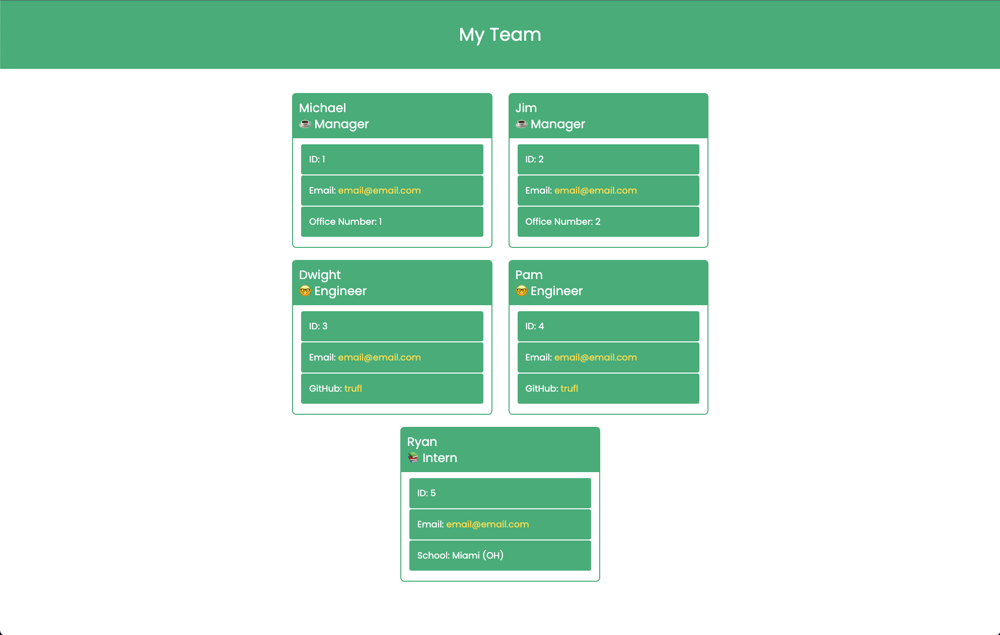

# Code Challenge 10 OOP: Team Profile Generator

## Description

The Team Profile Generator CLI application was the tenth challenge in our web development bootcamp. It was designed to challenge us with applying 
what we had learned that week about Object Oriented Programming. Some of the new tools I used were:
- JavaScript Classes
- Extending Classes to children Classes
- Using inquirer npm to get user info
- Get answers from inquirer object to supply info for HTML file

## Installation

Enter npm i in the CLI while in the same directory as the index.js file

## Usage

To use this application you first have to instal the required node packages and node if you do not already have it installed. To install the required packages enter the command
npm i in the CLI while in the same directory as the index.js file. Then enter node index for mac or node index.js for pc. You will then be prompted to enter your teams information.
The application will ask you for information about managers, engineers, and interns. To visit the application repo follow this link: 
https://github.com/trufl/Team-Profile-Generator

Example of application generated HTML file:

Run through of application:

## Credits

N/A

## License

N/A